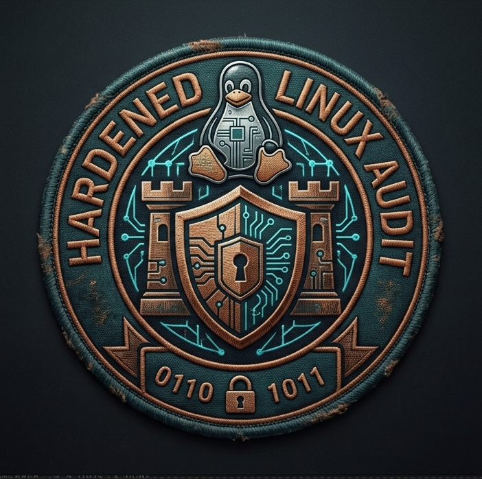

<p align="center">
  
</p>

# Hardened Linux Audit & Security Baseline

Automated Bash script to audit and harden Debian, Ubuntu, and Linux Mint systems against common security baseline configurations.

## Features

- **SSH Configuration:** Root login policy audit and auto-remediation.
- **Kernel Hardening (`sysctl`):** TCP SYN flood protection and ICMP redirect checks/remediation.
- **Firewall (`ufw`):** Uncomplicated Firewall status check and automated rule enforcement.
- **User Accounts & Passwords:** Empty password audit, UID 0 privilege scan, and `PASS_MAX_DAYS` expiration policy enforcement for system defaults and human accounts (UID >= 1000).
- **Unnecessary Services:** Audits and auto-disables insecure legacy services (`telnet`, `vsftpd`, `rsh-server`, `nis`).
- **File Permissions:** Verifies and corrects critical security file permissions (`/etc/shadow` to `600`/`640` and `/etc/passwd` to `644`).
- **System Logging & Updates:** Audits and enforces active `auditd` and `rsyslog` daemons, restricts `/var/log/syslog` permissions (`640`/`600`), and ensures `unattended-upgrades` is installed for automatic security patching.
- **File Integrity & Ports:** Scans system paths for SUID/SGID binaries, checks for risky world-writable files, and audits active listening TCP/UDP network ports.
- **Interactive Terminal Menu:** Clean dashboard interface with live Auto-Fix toggling, full suite execution, targeted single-module auditing/remediation, and **HTML Report Generation**.

## Usage

```bash
# Make script executable
chmod +x harden.sh

# Run interactive terminal menu (Default)
sudo ./harden.sh

# Run full security audit with auto-remediation directly via flag
sudo ./harden.sh --fix

## Disclaimer

This script is provided "as is," without warranty of any kind, express or implied. Hardening scripts modify system configurations, firewall rules, and service settings. Always test this script in a staging or non-production environment before running it on critical systems. The author takes no responsibility for any system downtime, locked-out access, or unintended configuration changes.
